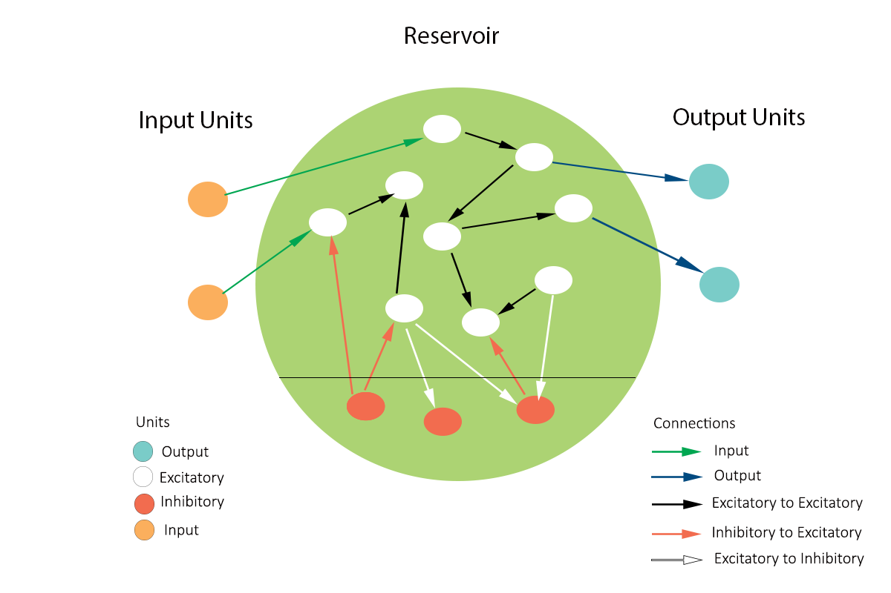

# Summary


The self-organizing recurrent neural (SORN) network is a class of neuro-inspired artificial networks. This class of networks has been shown to mimic the ability of neocortical circuits to learn and adapt through neuroplasticity mechanisms. Structurally, the SORN network consists of a pool of excitatory neurons and a small population of inhibitory neurons. The network uses five basic plasticity mechanisms found in the neocortex of the brain, namely, spike-timing-dependent plasticity, intrinsic plasticity, synaptic scaling, inhibitory spike-timing-dependent plasticity, and structural plasticity [@zheng2013network; @lazar2009sorn; @papa2017criticality] to optimize its parameters. Using a mathematical tools, SORN network simplifies the underlying structural and functional connectivity mechanisms responsible for learning and memory in the brain.

{width=80%}

`sorn` is a Python package designed for Self Organizing Recurrent Neural Networks. While it was originally developed for SORN networks, it can also serve as an ideal research package for Liquid State Machines [@jaeger2002adaptive; @jaeger2007special] in general. The detailed documentation can be found at [https://self-organizing-recurrent-neural-networks.readthedocs.io/en/latest/](self-organizing-recurrent-neural-networks.readthedocs.io). To extend the potential applications of this network architecture, a demonstrative example of a neuro-robotics experiment using OpenAI Gym [ @brockman2016openai] is provided at [sorn package](https://github.com/Saran-nns/sorn/).


## Statement of need

Reservoir computing (RC) models are neuroinspired artificial neural networks. RC networks have either sparsely or densely connected units with fixed connection weights. Unlike other RC models, SORN has synaptic weights controlled by neuroinspired plasticity mechanisms. The network has two distinct pools of excitatory and inhibitory reservoirs that compete to remain in a subcritical state suitable for learning. The subcritical state is a state between chaos and order, also called the "edge of chaos". In this state, the network has momentum with a strong affinity for order, but is sensitive to external perturbations. Through plasticity mechanisms, the network has the ability to overcome the perturbations and return to its subcritical dynamics. This self-adaptive behavior is also referred to as self-organization. To build such a network with a synergistic combination of plasticity mechanisms from scratch requires a deeper understanding of neurophysiology and soft computing. sorn' reduces the cognitive load of theorists, experimenters or researchers by encapsulating all plasticity mechanisms with a high degree of reliability and flexibility.

There are few other open source codes [sorn v1](https://github.com/delpapa/SORN), [sorn v2](https://github.com/delpapa/SORN_V2), for SORN networks, but they are application-specific and are not general-purpose software packages. However, 'sorn' is a flexible package that allows researchers to develop the network of their interest, providing them the freedom to choose the combination of plasticity rules of their choice. Moreover, it is easy to integrate 'sorn' with machine learning frameworks such as PyTorch and reinforcement learning toolkits such as OpenAI Gym. Overall, 'sorn' provides a research environment for computational neuroscientists to study self-organization, adaptation, learning, memory, and behavior of brain circuits by reverse-engineering neural plasticity mechanisms.


## Library Overview

The package `sorn` is heavily dependent on numpy [@harris2020array] for numerical computation and analysis methods, seaborn and matplotlib [@barrett2005matplotlib] for visualization. The network is constructed in five classes; the object `SORN` encapsulates all the required functions that instantiate network variables such as connection weights and thresholds. `Plasticity` inherits objects from `SORN` and implements plasticity rules with methods `stdp()`, `ip()`, `ss()`, `sp()` and `istdp()` . `NetworkState` has methods that evaluate excitatory and inhibitory network states at each time step and finally `MatrixCollection` objects behave like a memory cache. It collects the network states and keeps track of variables such as weights and thresholds as the network evolves during simulation and training.

The network can be instantiated, simulated and trained using two classes: `Simulator` and `Trainer`, which inherit objects from `SORN`.

## SORN Network Model

As defined in [@lazar2009sorn; @zheng2013network] the activity of neurons in the excitatory and inhibitory pool is given by the following state equations,

\begin{equation}
\label{es}
x_i(t+1) =  \Theta\left (\sum_{j=1}^{N^\text{E}} {W_{ij}^\text{EE}(t)} {x_{j}(t)} - \sum_{j=1}^{N^\text{I}}W_{ik}^\text{EI}(t) y_{k}(t)+u_{i}(t) - T_{i}^\text{E}(t)+\xi_\text{E}(t)\right)
\end{equation}

\begin{equation}
\label{is}
y_i(t+1)=\Theta\left(\sum_{j=1}^{N_i}W_{ij}^\text{IE}(t) x_j(t)-T_i^\text{I}+ \xi_\text{I}(t)\right)
\end{equation}

$W_{ij}^\text{EE}$ -  Connection strength between excitatory neurons

$W_{ik}^\text{EI}$ - Synaptic strenght from Inhibitory to excitatory network

$W_{ki}^\text{IE}$ - Synaptic strenght from Exciatory to inhibitory network

$x_{j}(t)$ - Presynaptic excitatory neuron state at $t$

$y_{k}(t)$ - Presynaptic inhibitory neuron state at $t$

$x_{i}(t)$ - Postsynaptic neuron state at $t$

$u_{i}$ - External stimuli

$T_{i}(t)$ - Firing threshold of the neuron $i$ at time $t$


## Plasticity Rules

### Spike Timing Dependent Plasticity

Spike Timing Dependent Plasticity (STDP) alters synaptic efficacy between excitatory neurons  based on the spike timing between pre- $j$ and postsynaptic neuron $i$.

\begin{equation}
\label{stdp}
\Delta W_{ij}^{EE}=\eta_{STDP}(x_i(t)x_j(t-1)-x_i(t-1)x_j(t))
\end{equation}

where,

$W_{ij}^\text{EE}$ -  Connection strength between excitatory neurons

$\eta_\text{STDP}$ - STDP learning rate

$x_j(t-1)$ - Presynaptic neuron state at $t-1$

$x_i$ - Postsynaptic neuron state at $t$


### Intrinsic Plasticity

IP updates the firing threshold of excitatory neurons based on the state of the neuron at each time step. It increases the threshold if the neuron is firing and decreases it otherwise.

\begin{equation}
\label{ip}
T_i(t+1)=T_i(t)+\eta_\text{IP}{x_i(t)-\text{H_{IP}}}
\end{equation}

where,

$T_i(t)$ - Firing threshold of the neuron $i$ at time $t$

$\eta_\text{IP}$ - Intrinsic plasticity step size

$\text{H_{IP}}$ - Target firing rate of the neuron

### Structural Plasticity

Structural Plasticity (SP) is responsible for creating new synapses between excitatory neurons at a rate of about 1 connection per 10th time step.

### Synaptic Scaling

Synaptic Scaling (SS) normalizes the synaptic strengths of presynaptic neurons and prevents network activity from declining or exploding.

\begin{equation}
\label{ss}
W_{ij}^\text{EE}(t)=W_{ij}^\text{EE}(t)/\sum{W_{ij}^\text{EE}(t)}
\end{equation}

### Inhibitory Spike Timing Dependent Plasticity

Inhibitory Spike Timing Dependent Plasticity (iSTDP) is responsible for controlling synaptic strengths from the inhibitory to the excitatory network.

\begin{equation}
\label{istdp}
\Delta W_{ij}^\text{EI}=\eta_\text{istdp}\left(y_j(t-1)(1-x_i(t)(1+\frac{1}{\mu_\text{ip}}))\right)
\end{equation}


where,

$W_{ij}^\text{EI}$ - Synaptic strength from Inhibitory to excitatory network

$\eta_\text{istdp}$ - Inhibitory STDP learning rate

$\mu_\text{ip}$ - Mean firing rate of the neuron

Note that the connection strength from excitatory to inhibitory ($W_{ij}^\text{IE}$) remains fixed at the initial state and also the connections between inhibitory neurons are not allowed.

## Sample Simulation methods
```python

# Sample input
num_features = 10
time_steps = 200
inputs = numpy.random.rand(num_features,time_steps)

state_dict,E,I,R,C=Simulator.simulate_sorn(inputs=inputs,phase='plasticity',

                                        matrices=None,noise=True,

                                        time_steps=time_steps,ne=200,

                                        nu=num_features)
```
`simulate_sorn` returns the dictionary of network state variables of the previous time steps, the excitatory and inhibitory network activity of the whole simulation period, and also the recurrent activity and the number of active connections at each time step. To continue the simulation, load the matrices returned in the previous step as,

```python
state_dict,E,I,R,C=Simulator.simulate_sorn(inputs=inputs,phase='plasticity',

                                        matrices=state_dict, noise=True,

                                        time_steps=time_steps,

                                        ne = 200,nu=num_features)

```

### Network Output Descriptions

`state_dict` - Dictionary of connection weights ('Wee', 'Wei', 'Wie') ,

               Excitatory network activity ('X'),

               Inhibitory network activities('Y'),

               Threshold values ('Te', 'Ti')

`E` - Collection of Excitatory network activity of entire simulation period

`I` - Collection of Inhibitory network activity of entire simulation period

`R` - Collection of Recurrent network activity of entire simulation period

`C` - List of number of active connections in the Excitatory pool at each time step


## Sample Training methods
```python
from sorn import Trainer
inputs = np.random.rand(num_features,1)

# Under all plasticity mechanisms
state_dict,E,I,R,C=Trainer.train_sorn(inputs=inputs,phase='plasticity',

                                    matrices=state_dict,

                                    nu=num_features,time_steps=1)


# Resume the training without any plasticity mechanisms

state_dict,E,I,R,C=Trainer.train_sorn(inputs=inputs,phase='training',

                                    matrices=state_dict,

                                    nu=num_features,time_steps=1)
```

To turn off any plasticity mechanisms during the simulation or training phase, you can use the argument `freeze`. For example, to stop intrinsic plasticity during the training phase,

```python

state_dict,E,I,R,C=Trainer.train_sorn(inputs=inputs,phase='plasticity',

                                    matrices=None,noise=True,

                                    time_steps=1,ne=200,

                                    nu=num_features,freeze=['ip'])

```
The other options for `freeze` argument are,

`stdp` - Spike Timing Dependent Plasticity

`ss` - Synaptic Scaling

`sp` - Structural Plasticity

`istdp` - Inhibitory Spike Timing Dependent Plasticity

Note: If you pass all above options to freeze, then the network will behave as Liquid State Machine(LSM)

The `simulate_sorn` and `train_sorn` methods accepts the following keyword arguments

| kwargs                 |                                          Description                                       |
|------------------------|--------------------------------------------------------------------------------------------|
| `inputs`               |  External stimulus                                                                         |
| `phase`                |  `plasticity` or `training`                                                                |
| `matrices`             |  `state_dict` to resume simulation otherwise `None` to intialize new network               |
| `time_steps`           |  `simulaton` total time steps. For `training` should be 1                                  |
| `noise`                |  If `True`, Gaussian white noise will be added to excitatory field potentials              |
| `freeze`               |  To drop any given plasticity mechanism(s) among [`'ip'`,`'stdp'`,`'istdp'`,`'ss'`, `'sp'`]|
| `ne`                   |  Number of Excitatory neurons in the network                                               |
| `nu`                   |  Number of input units among excitatory neurons                                            |
| `network_type_ee`      |  `sparse` or  `dense` connection between excitatory neurons                                |
| `network_type_ei`      |  `sparse` or  `dense` connection from inhibitory and excitatory neurons                    |
| `network_type_ie`      |  `sparse` or  `dense` connection from excitatory and inhibitory neurons                    |
| `lambda_ee`            |  Connection density between excitatory networks if network type is `sparse`                |
| `lambda_ei`            |  Density of connections from inhibitory to excitatory networks if network type is `sparse` |
| `lambda_ie`            |  Density of connections from inhibitory to excitatory networks if network type is `sparse` |
| `eta_stdp`             |  Hebbian learning rate of excitatory synapses                                              |
| `eta_inhib`            |  Hebbian learning rate synapses from inhibitory to excitatory                              |
| `eta_ip`               |  Learning rate of excitatory neuron threshold                                              |
| `te_max`               |  Maximum of excitatory neuron threshold range                                              |
| `ti_max`               |  Maximum of inhibitory neuron threshold range                                              |
| `ti_min`               |  Minimum of inhibitory neuron threshold range                                              |
| `te_min`               |  Minimum of excitatory neuron threshold range                                              |
| `mu_ip`                |  Target Mean firing rate of excitatory neuron                                              |
| `sigma_ip`             |  Target Standard deviation of firing rate of excitatory neuron                             |


### Analysis functions

The `sorn` package also includes necessary methods to investigate network properties. A few of the methods in the `Statistics` module are:


| methods                         |                                      Description                                  |
|---------------------------------|-----------------------------------------------------------------------------------|
| `autocorr`                      |  t-lagged auto correlation between neural activity                                |
| `fanofactor`                    |  To verify poissonian process in spike generation of neuron(s)                    |
| `spike_source_entropy`          |  Measure the uncertainty about the origin of spike from the network using entropy |
| `firing_rate_neuron`            |  Spike rate of specific neuron                                                    |
| `firing_rate_network`           |  Spike rate of entire network                                                     |
| `avg_corr_coeff`                |  Average Pearson correlation coeffecient between neurons                          |
| `spike_times`                   |  Time instants at which neuron spikes                                             |
| `spike_time_intervals`          |  Inter spike intervals for each neuron                                            |
| `hamming_distance`              |  Hamming distance between two network states                                      |

More details about the statistical and plotting tools in the package can be found at ([https://self-organizing-recurrent-neural-networks.readthedocs.io/en/latest/](self-organizing-recurrent-neural-networks.readthedocs.io))

# References